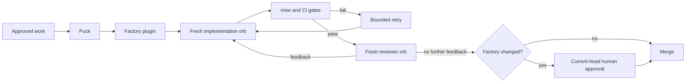
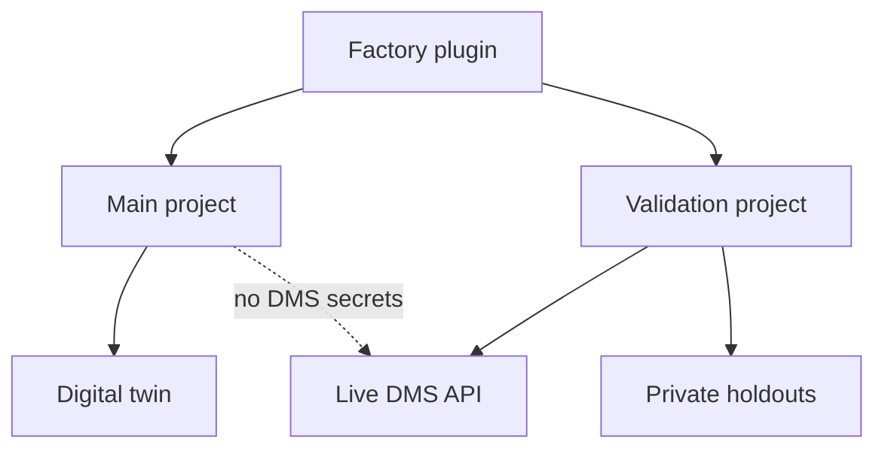

# Factory

The factory is the repository-owned system that turns approved work into reviewed, verified changes. Amp supplies orchestration and isolated orbs; this repository supplies policy, workflows, runbooks, and deterministic `mise` gates. Agents propose and evaluate changes, while shell exit codes decide mechanical gates.

Most pull requests merge as soon as CI passes and an independent reviewer reports no further feedback. A pull request that touches the factory additionally requires trusted human approval of its current head. Publishing and account changes retain their explicit authority requirements.

Puck is the operator interface: it launches, monitors, steers, and summarizes work. The checked-in plugin remains the durable control plane for gates, retries, events, and merge policy.

The main Amp project runs implementation without DMS credentials. Live differential checks and holdouts run only in the validation project, which owns narrowly scoped secrets. Regular development and tests use the deterministic twin rather than the live service.

## Repository structure

- `.amp/plugins/factory/` contains the executable control plane.
- `.agents/setup` and `.agents/resume` establish the pinned mise environment in every orb.
- `docs/factory/invariants.md` tracks invariant ownership, proof, and enforcement status.
- `docs/automations/` contains loop runbooks and automation-owned state.
- `docs/guardrails/` gives workers only the guidance relevant to their task.
- `docs/PLAN.md` defines active phase gates; completed plans and reports move to `docs/history/`.

The factory-improvement loop examines failures, sanitized process evidence, and unenforced invariants. Its pull requests follow the same merge policy and require human approval because they change the factory. A durable health webhook provides recovery because failed Amp schedules pause.

`bin/check-factory-approval` defines factory-sensitive paths. The `Factory Approval` workflow passes immediately for other changes and requires a trusted human approval tied to the current commit for factory changes. The check must be required by the `main` branch ruleset.

The Phase 0 foundation is verified. Orb setup, isolation, secret delivery, deterministic gate behavior, and webhook recovery work. Phase pipelines, automated reviewed-and-green merging, bounded attempt controllers, parallel review, durable workflow state, issue routing, and scheduled loops are implemented incrementally with the product phases.
