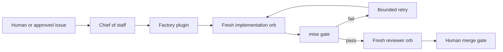
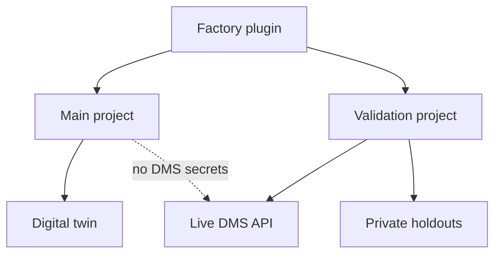

# Factory

The factory is the repository-owned system that turns approved work into reviewed, verified changes. Amp supplies orchestration and isolated orbs; this repository supplies policy, workflows, runbooks, and deterministic `mise` gates. Agents propose and evaluate changes, but shell exit codes decide mechanical gates and humans merge specification-expanding work.

The main Amp project runs implementation without DMS credentials. Live differential checks and holdouts run only in the validation project, which owns narrowly scoped secrets. Regular development and tests use the deterministic twin rather than the live service.

## Repository structure

- `.amp/plugins/factory/` contains the executable control plane.
- `.agents/setup` and `.agents/resume` establish the pinned mise environment in every orb.
- `docs/factory/invariants.md` tracks invariant ownership, proof, and enforcement status.
- `docs/automations/` contains loop runbooks and automation-owned state.
- `docs/guardrails/` gives workers only the guidance relevant to their task.
- `PLAN.md` defines active phase gates; completed plans and reports move to `docs/history/`.

The factory-improvement loop examines failures, sanitized process evidence, and unenforced invariants. It proposes deterministic checks and may open a pull request, but it never merges one. A durable health webhook provides recovery because failed Amp schedules pause.

The Phase 0 foundation is verified. Orb setup, isolation, secret delivery, deterministic gate behavior, and webhook recovery work. Phase pipelines, bounded attempt controllers, parallel review, durable workflow state, issue routing, and scheduled loops are implemented incrementally with the product phases.
