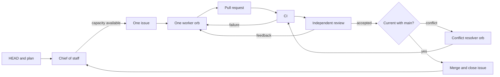

# Factory

The factory turns repository state into reviewed, verified changes. Amp supplies isolated orbs; this directory supplies orchestration, runbooks, guardrails, and deterministic gates.

The chief of staff is the only role that reads `docs/PLAN.md` as a phase guide. It compares the plan with `HEAD`, open issues, pull requests, and active workers; identifies the next independent units of work; and creates issues only when capacity exists. One issue owns one implementation worker. Phases influence what work is timely but are not factory states.

The chief of staff shepherds each issue until merge or an interminable blocker. Retries are bounded. Any changed head repeats CI and independent review. Conflicts go to a fresh resolver rather than the original worker. GitHub issues, branches, pull requests, reviews, and checks are durable workflow state.

Most changes merge after CI passes and an independent reviewer has no further feedback. During construction, branch protection and signature enforcement remain disabled. Final activation installs those controls and requires an owner-signed current head for factory changes. Publishing, destructive operations, paid-orb actions, and account changes always require explicit authority.

## Layout

- `factory/plugin/` is the executable control plane; `.amp/plugins/factory` is its Amp adapter.
- `factory/orb/` establishes the pinned mise environment; `.agents/` exposes Amp's required paths.
- `factory/guardrails/` and `factory/automations/` contain routed worker instructions.
- `factory/invariants.md` records factory-owned enforcement.
- `deadmanssnitch/`, `mcp-deadmanssnitch/`, `deadmanssnitch-twin/`, and `deadmanssnitch-conformance/` are the product projects.

The main Amp project has no DMS credentials. Twin validation receives only the DMS test key. Holdout validation receives only its repository token and tests through the twin.
